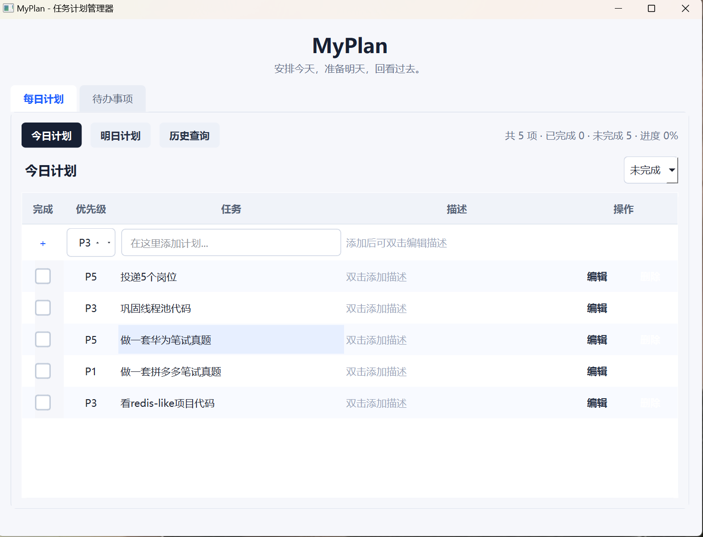
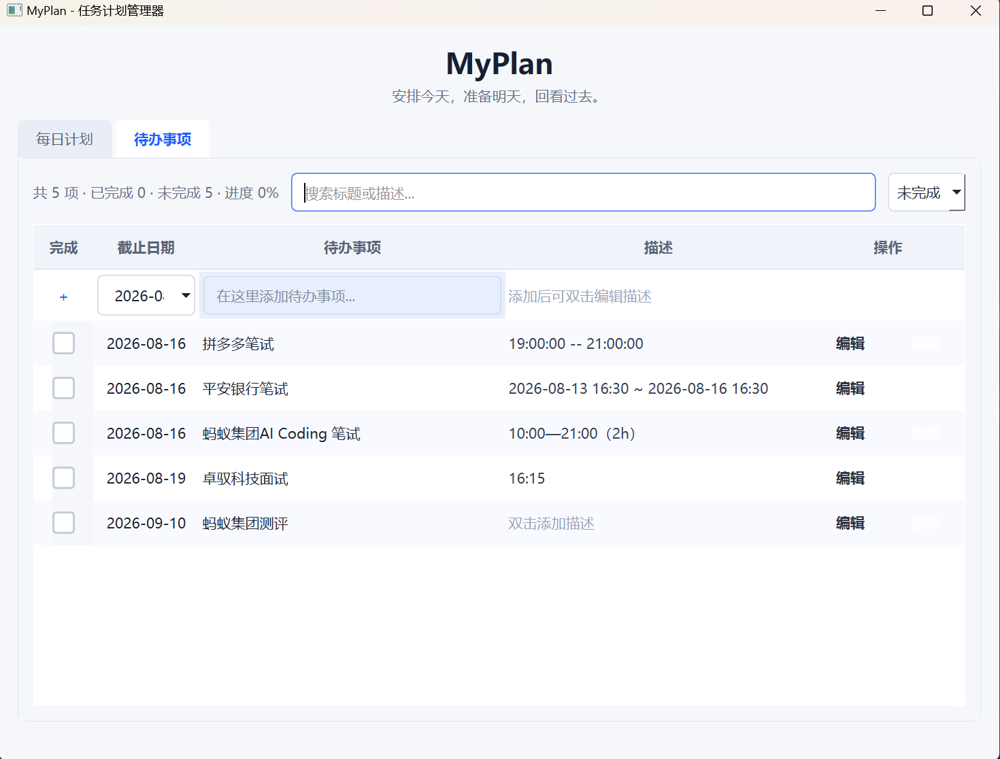

# MyPlan - 任务计划管理器

一个轻量级的桌面任务管理应用，用于规划日常工作和记录待办事项。

## 功能特性

### 📅 每日计划

- 支持今日计划、明日计划和历史查询三种视图
- 在表格内嵌输入行直接添加计划（标题 + 优先级 P1-P5）
- 按完成状态和截止日期排序（未完成优先，有截止日期的优先）
- 点击复选框标记完成，已完成项显示蓝色勾选、文字变灰、标题添加删除线
- 单击"编辑"按钮或双击行打开编辑对话框，支持修改标题、优先级和描述
- 历史查询支持"全部历史"、"近一周"、"具体某一天"三种范围，支持搜索过滤
- 状态筛选器（全部 / 未完成 / 已完成）
- 统计信息显示总项数、已完成、未完成和进度百分比



### ✅ 待办事项

- 记录带截止日期的待办事项
- 在表格内嵌输入行直接添加（标题 + 截止日期选择器）
- 按截止日期升序排序（越临近截止日期的越靠前），未完成优先
- 点击复选框标记完成，已完成项显示蓝色勾选、文字变灰、标题添加删除线
- 单击"编辑"按钮或双击行打开编辑对话框，支持修改标题、截止日期和描述
- 搜索过滤（按标题或描述搜索）
- 状态筛选器（全部 / 未完成 / 已完成）
- 统计信息显示总项数、已完成、未完成和进度百分比



## 编译环境

- Windows 7 或更高版本
- Qt 6.9.3
- MinGW 13.1.0 编译工具链
- CMake 3.5+
- Ninja 构建工具

## 快速开始

### 编译方法 1：使用 CMake 预设（推荐）

```powershell
cd D:\MyPlan
cmake --preset mingw
cd build
ninja
```

### 编译方法 2：手动编译

```powershell
cd D:\MyPlan
rm -r build -Force
mkdir build
cd build

cmake .. -G Ninja `
  -DCMAKE_MAKE_PROGRAM="D:/QT/Tools/Ninja/ninja.exe" `
  -DCMAKE_C_COMPILER="D:/QT/Tools/mingw1310_64/bin/gcc.exe" `
  -DCMAKE_CXX_COMPILER="D:/QT/Tools/mingw1310_64/bin/g++.exe" `
  -DCMAKE_PREFIX_PATH="D:/QT/6.9.3/mingw_64;D:/QT/Tools/mingw1310_64"

cmake --build .
```

## 运行应用

```powershell
D:\MyPlan\build\qt_test.exe
```

## 数据存储

所有任务数据以 JSON 格式保存在：

```
%APPDATA%\MyPlan\tasks.json
```

数据字段包含：

- 任务 ID (UUID)
- 任务标题和描述
- 计划日期（每日计划）
- 截止日期（待办事项）
- 创建日期
- 优先级（1-5，每日计划）
- 完成状态

## 使用指南

### 每日计划

1. 选择"每日计划"选项卡
2. 通过"今日计划"、"明日计划"、"历史查询"按钮切换视图
3. 在表格第一行的内嵌输入框中输入标题并选择优先级（P1-P5），按回车或点击"添加"
4. 点击任务行的复选框切换完成状态
5. 单击"编辑"按钮或双击任务行打开编辑对话框，可修改标题、优先级和描述
6. 历史查询模式下可使用"全部历史"/"近一周"/"具体某一天"筛选范围，并支持关键词搜索

### 待办事项

1. 选择"待办事项"选项卡
2. 在表格第一行的内嵌输入框中输入标题并选择截止日期，按回车或点击"添加"
3. 点击任务行的复选框切换完成状态
4. 单击"编辑"按钮或双击任务行打开编辑对话框，可修改标题、截止日期和描述
5. 使用搜索框和状态筛选器过滤待办事项列表

### 删除任务

在任务行的"操作"列点击"删除"按钮，确认后即可删除。

### 数据保存

应用在添加、删除、修改任务时自动保存到 JSON 文件，退出时也会自动保存。

## 项目结构

```
D:\MyPlan/
├── src/
│   ├── main.cpp           # 应用入口
│   ├── qt_test.h/cpp      # 主窗口视图和事件处理
│   ├── qt_test.ui         # UI 布局文件
│   ├── task.h/cpp         # 任务数据模型（JSON 序列化）
│   └── taskmanager.h/cpp  # 任务管理器（业务逻辑）
├── build/                 # 构建输出目录
└── CMakeLists.txt         # CMake 构建配置
```

## 技术实现

### 架构

- **MVC 模式**：Task（模型）→ TaskManager（控制器）→ qt_test（视图）
- **事件驱动**：通过 Qt 的信号槽机制处理用户交互
- **数据持久化**：使用 Qt 的 QJsonDocument 进行 JSON 序列化

### 关键类

#### Task（src/task.h）

表示单个任务的数据结构，支持 JSON 序列化和反序列化。

```cpp
struct Task {
    QString id;              // UUID 唯一标识
    QString title;           // 任务标题
    QString description;     // 任务描述
    QDate date;             // 计划日期（每日计划）
    QDate dueDate;          // 截止日期（待办事项）
    QDate createdAt;        // 创建日期
    int priority;           // 优先级 1-5（每日计划）
    bool completed;         // 完成状态
    bool isDaily;           // 是否为每日计划
};
```

#### TaskManager（src/taskmanager.h）

管理所有任务的业务逻辑：

- 加载/保存 JSON 文件
- 按日期、类型查询任务
- 按截止日期排序（待办事项升序，每日计划降序）
- CRUD 操作

主要方法：

- `loadFromFile()` / `saveToFile()` — JSON 文件读写
- `getDailyTasks()` — 获取特定日期的每日计划
- `getTodoTasks()` — 获取待办事项列表
- `getAllDates()` — 获取所有有历史计划的日期
- `addTask()` / `removeTask()` / `updateTask()` — 增删改操作
- `markCompleted()` — 切换完成状态

#### qt_test（src/qt_test.h）

主窗口 UI 和事件处理：

- 两个选项卡界面（每日计划 + 待办事项）
- 每日计划支持今日/明日/历史三种视图
- 表格内嵌输入行用于快速添加任务
- 编辑对话框支持修改标题、描述、优先级/截止日期
- 搜索过滤和状态筛选
- 统计信息面板

## 编译故障排除

### 问题 1：CMake 找不到 Qt6

```
解决方案：确保 CMAKE_PREFIX_PATH 指向正确的 Qt 6.9.3 目录
cmake --preset mingw  # 使用预设会自动设置
```

### 问题 2：Ninja 编译失败

```
解决方案：确保 Ninja 可执行文件路径正确
使用完整路径：D:\QT\Tools\Ninja\ninja.exe
```

### 问题 3：UI 文件无法生成

```
解决方案：
1. 删除 build 目录
2. 确保 Qt6 版本正确（需要 Qt 6.9.3）
3. 清理 CMake 缓存后重新配置
```

## 后续改进建议

- 支持任务分类和标签
- 添加提醒和通知功能
- 支持导入/导出功能
- 实现重复任务功能
- 支持暗黑模式

## 版本历史

### v1.0 (2026-08-14)

- 每日计划：今日/明日/历史三种视图，内嵌输入行添加
- 待办事项：支持截止日期，按截止日期排序
- 任务完成：复选框勾选、文字变灰、标题删除线三重反馈
- 搜索过滤：按标题和描述搜索，状态筛选器
- 统计信息：总项数、已完成、未完成、进度百分比
- 编辑对话框：支持修改标题、描述、优先级/截止日期
- JSON 数据持久化，自动保存
- 浅色主题 UI，自定义日历控件样式

---

**最后更新**: 2026-08-14
**构建状态**: 成功
**运行状态**: 正常
